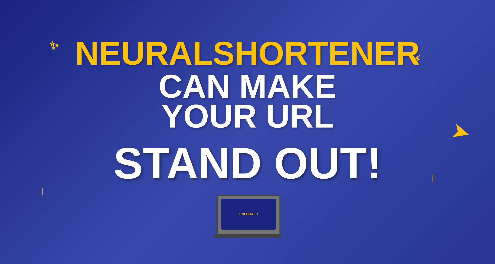

# Neural URL Shortener 🔗

A modern, full-featured URL shortener built with React, Supabase, and Tailwind CSS. Transform long URLs into short, shareable links with comprehensive analytics and QR code generation.



## 🚀 Live Demo

**[Try Neural URL Shortener](https://neural-shortener.netlify.app)**

Experience the full functionality of the URL shortener with user authentication, analytics, and QR code generation.

## ✨ Features

- **URL Shortening**: Convert long URLs into short, memorable links
- **Custom URLs**: Create personalized short URLs with custom aliases
- **QR Code Generation**: Automatic QR code creation for each shortened URL
- **Analytics Dashboard**: Track clicks, locations, and device statistics
- **User Authentication**: Secure signup/login with profile management
- **Responsive Design**: Works seamlessly on desktop and mobile devices
- **Real-time Statistics**: View detailed analytics with interactive charts

## 🚀 Tech Stack

- **Frontend**: React 19, Vite, Tailwind CSS
- **Backend**: Supabase (Database, Authentication, Storage)
- **UI Components**: Radix UI, shadcn/ui
- **Charts**: Recharts
- **QR Codes**: react-qrcode-logo
- **Routing**: React Router DOM
- **Form Validation**: Yup
- **Icons**: Lucide React

## 📋 Prerequisites

Before running this project, make sure you have:

- Node.js (v18 or higher)
- npm or yarn
- A Supabase account and project

## 🛠️ Installation

1. **Clone the repository**
   ```bash
   git clone <repository-url>
   cd url-shortener
   ```

2. **Install dependencies**
   ```bash
   npm install
   ```

3. **Set up environment variables**
   Create a `.env` file in the root directory:
   ```env
   VITE_SUPABASE_URL=your_supabase_project_url
   VITE_SUPABASE_KEY=your_supabase_anon_key
   ```

4. **Set up Supabase Database**
   
   Create the following tables in your Supabase database:

   **URLs Table:**
   ```sql
   CREATE TABLE urls (
     id UUID DEFAULT gen_random_uuid() PRIMARY KEY,
     title TEXT NOT NULL,
     original_url TEXT NOT NULL,
     short_url TEXT UNIQUE NOT NULL,
     custom_url TEXT UNIQUE,
     user_id UUID REFERENCES auth.users(id) ON DELETE CASCADE,
     qr TEXT,
     created_at TIMESTAMP WITH TIME ZONE DEFAULT NOW()
   );
   ```

   **Clicks Table:**
   ```sql
   CREATE TABLE clicks (
     id UUID DEFAULT gen_random_uuid() PRIMARY KEY,
     url_id UUID REFERENCES urls(id) ON DELETE CASCADE,
     city TEXT,
     country TEXT,
     device TEXT,
     created_at TIMESTAMP WITH TIME ZONE DEFAULT NOW()
   );
   ```

5. **Set up Supabase Storage**
   
   Create two storage buckets:
   - `profile-pic` (for user profile pictures)
   - `qrs` (for QR code images)

6. **Configure Row Level Security (RLS)**
   
   Enable RLS on both tables and create appropriate policies for user data access.

## 🏃‍♂️ Running the Application

1. **Development mode**
   ```bash
   npm run dev
   ```
   The application will be available at `http://localhost:5173`

2. **Build for production**
   ```bash
   npm run build
   ```

3. **Preview production build**
   ```bash
   npm run preview
   ```

## 📱 Usage

### Creating Short URLs

1. **Sign up or log in** to your account
2. **Navigate to Dashboard** after authentication
3. **Click "Create New Link"** button
4. **Fill in the form**:
   - Enter a title for your link
   - Paste the long URL
   - Optionally add a custom short URL
5. **Click "Create"** to generate your short link with QR code

### Managing Links

- **View all links** on your dashboard
- **Search and filter** links by title
- **Copy short URLs** to clipboard
- **Download QR codes** for offline sharing
- **Delete unwanted links**
- **View detailed analytics** by clicking on any link

### Analytics Features

- **Total clicks** count
- **Geographic data** showing click locations
- **Device statistics** (mobile vs desktop)
- **Interactive charts** for data visualization
- **Real-time updates** as clicks occur

## 🎨 Customization

### Styling
The project uses Tailwind CSS with a custom dark theme. Modify `src/index.css` to customize colors and styling.

### Components
UI components are built with Radix UI and shadcn/ui. Customize components in the `src/components/ui/` directory.

### Branding
Replace logo and banner images in the `public/` directory with your own branding assets.

## 📊 Database Schema

### URLs Table
- `id`: Unique identifier
- `title`: User-defined title
- `original_url`: The long URL to redirect to
- `short_url`: Generated short identifier
- `custom_url`: Optional custom alias
- `user_id`: Reference to authenticated user
- `qr`: QR code image URL
- `created_at`: Timestamp

### Clicks Table
- `id`: Unique identifier
- `url_id`: Reference to URLs table
- `city`: Click location city
- `country`: Click location country
- `device`: Device type (mobile/desktop)
- `created_at`: Click timestamp

## 🔒 Security Features

- **Row Level Security (RLS)** ensures users can only access their own data
- **Authentication** required for creating and managing links
- **Secure file uploads** for profile pictures and QR codes
- **Input validation** on all forms
- **Protected routes** for authenticated content

## 🚀 Deployment

The application can be deployed to various platforms:

### Netlify
1. Build the project: `npm run build`
2. Deploy the `dist` folder to Netlify
3. Configure environment variables in Netlify dashboard
4. Add `_redirects` file for client-side routing support

### Vercel
1. Connect your repository to Vercel
2. Configure environment variables
3. Deploy automatically on push

## 🤝 Contributing

1. Fork the repository
2. Create a feature branch: `git checkout -b feature-name`
3. Commit changes: `git commit -am 'Add feature'`
4. Push to branch: `git push origin feature-name`
5. Submit a pull request

## 📝 License

This project is licensed under the MIT License - see the LICENSE file for details.

## 🙏 Acknowledgments

- [Supabase](https://supabase.com) for backend services
- [shadcn/ui](https://ui.shadcn.com) for beautiful UI components
- [Tailwind CSS](https://tailwindcss.com) for styling
- [Recharts](https://recharts.org) for analytics visualization

## 📞 Support

If you encounter any issues or have questions:

1. Check the [Issues](../../issues) section
2. Create a new issue with detailed information
3. Contact the maintainer

---

**Made with ❤️ by Shashikanth**